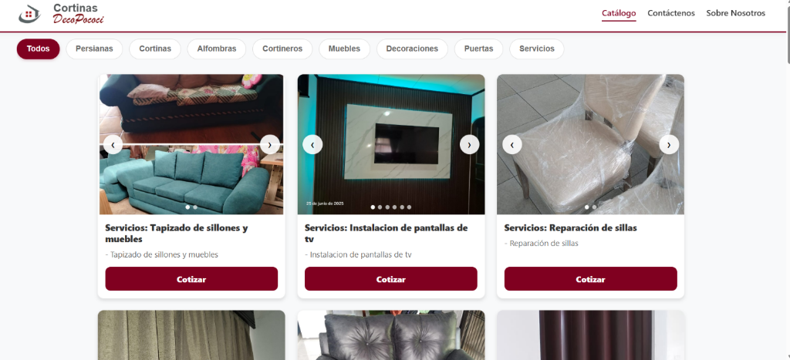
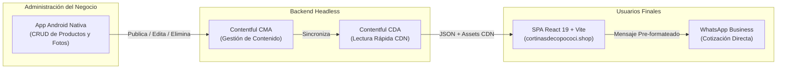

<div align="center">

  

  # Cortinas DecoPococí — Catálogo Digital Interactivo

  **Plataforma web comercial diseñada y desarrollada a medida para la exhibición de productos, decoración y servicios de tapicería e instalación en Pococí, Costa Rica.**

  [](https://www.cortinasdecopococi.shop/)
  [](https://react.dev/)
  [](https://vite.dev/)
  [](https://www.contentful.com/)
  [](https://www.cortinasdecopococi.shop/)

</div>

---

## Vista Previa del Proyecto

<div align="center">
  <a href="https://www.cortinasdecopococi.shop/" target="_blank">
    
  </a>
  <p><em>Interfaz principal en producción (<a href="https://www.cortinasdecopococi.shop/">cortinasdecopococi.shop</a>) mostrando el carrusel interactivo por tarjeta, barra de categorías y acceso directo a cotización.</em></p>
</div>

---

## Caso de Estudio (Cliente Real)

**Cortinas DecoPococí** requería modernizar la presentación de su inventario de cortinas a medida, persianas, alfombras, muebles y servicios de tapicería/instalación, permitiendo a sus clientes explorar fotografías reales de trabajos terminados y solicitar cotizaciones inmediatas sin fricción.

### Solución Implementada
Se diseñó e implementó una arquitectura desacoplada (*Headless*) compuesta por:
1. **Aplicación Web Pública (Este Repositorio):** SPA ultrarrápida construida con **React 19** y **Vite**, enfocada en experiencia de usuario (*UX*), carga instantánea y conversión directa hacia WhatsApp.
2. **Gestión de Contenido en la Nube (Contentful CMS):** Almacenamiento estructurado de productos, múltiples activos fotográficos de alta resolución, categorías y etiquetas dinámicas.
3. **Ecosistema Móvil Administrativo:** Sincronización en tiempo real con una aplicación Android nativa (Kotlin / Jetpack Compose) utilizada por el cliente para publicar, editar o eliminar productos e imágenes desde su teléfono sin tocar código.

---

## Características Principales

- **Catálogo Dinámico en Tiempo Real:** Consumo directo de la *Content Delivery API* (CDA) de Contentful con normalización y validación de datos resiliente.
- **Filtrado Multicapa Inteligente:**
  - **Nivel 1 (Categorías Principales):** Carril horizontal deslizable con categorías prioritarias (*Persianas, Cortinas, Alfombras, Cortineros, Muebles, Decoraciones, Puertas, Servicios*).
  - **Nivel 2 (Subcategorías / Variantes):** Generación dinámica de etiquetas combinables según la categoría activa (*Tela, Blackout, Motorizada, Madera, Tapicería, Instalación*, etc.).
- **Carrusel Multimedios en Tarjetas:** Cada tarjeta de producto soporta galerías de múltiples fotografías con navegación circular (`‹` / `›`) e indicadores de posición (*dots*).
- **Visor de Imágenes Avanzado (*Lightbox Modal*):**
  - **Zoom Progresivo:** Acercamiento desde `100%` hasta `300%` con controles dedicados.
  - **Pan & Drag Interactivo:** Desplazamiento libre sobre la imagen ampliada tanto en pantallas táctiles (*touch events*) como con el cursor (*mouse drag*).
  - **Navegación por Teclado y Miniaturas:** Soporte completo para teclas `Esc`, `←`, `→` y tira inferior de miniaturas.
- **Conversión Directa por WhatsApp:** Botón de acción *"Cotizar"* en cada producto que genera automáticamente un enlace `wa.me` con el nombre exacto del artículo o servicio seleccionado.
- **Diseño Minimalista & Responsivo:** Estética limpia alineada con la identidad visual de la marca (tonos vino `#800020`, dorado y superficies blancas) adaptada a móviles, tablets y escritorio.

---

## Arquitectura del Sistema



---

## Stack Tecnológico

| Área | Tecnología | Propósito |
| :--- | :--- | :--- |
| **Frontend Core** | React 19 | Construcción declarativa de interfaz y manejo de estado reactivo (`useMemo`, `useState`, `useEffect`). |
| **Build Tool** | Vite 7 | Empaquetado optimizado, HMR instantáneo y carga eficiente de activos. |
| **Headless CMS** | Contentful SDK (`^11.10.2`) | Obtención de entradas estructuradas y resolución de activos multimedia vía CDN. |
| **Estilos & UI** | CSS3 + Custom Variables | Diseño responsivo con *CSS Grid*, *Flexbox*, *Scroll Snap* y animaciones fluidas sin dependencias pesadas. |
| **Calidad de Código** | ESLint 9 | Reglas de estilo y buenas prácticas para React Hooks y Fast Refresh. |
| **Hosting & CI/CD** | Vercel | Despliegue continuo automático desde la rama `main` de GitHub. |

---

## Estructura del Proyecto

```text
DecoPococi/
├── public/
│   ├── favicon.png            # Icono oficial de la marca
│   ├── favicon.ico            # Favicon compatible con navegadores clásicos
│   └── preview.png            # Captura de vista previa para OpenGraph y README
├── src/
│   ├── assets/                # Logotipos vectoriales (SVG) y recursos gráficos de marca
│   ├── components/
│   │   ├── Header.jsx         # Encabezado institucional y navegación
│   │   ├── CategoryFilter.jsx # Barra horizontal de categorías principales
│   │   ├── TagFilter.jsx      # Filtro dinámico de subcategorías / etiquetas
│   │   ├── ProductCard.jsx    # Tarjeta de producto con carrusel integrado y CTA a WhatsApp
│   │   ├── ImageModal.jsx     # Visor modal con Zoom (1x-3x), Pan/Drag y miniaturas
│   │   └── Footer.jsx         # Pie de página con información de contacto y ubicación
│   ├── utils/
│   │   └── contentful.js      # Normalizador de entradas, URLs e imágenes de Contentful
│   ├── App.jsx                # Lógica central de estado, filtrado y orquestación de vistas
│   ├── App.css                # Sistema de diseño, variables de tema y media queries
│   ├── client.js              # Configuración del cliente oficial de Contentful
│   └── main.jsx               # Punto de entrada de la aplicación React
├── index.html                 # Plantilla raíz con metadatos SEO y OpenGraph
├── package.json               # Dependencias y scripts de construcción
└── vite.config.js             # Configuración de Vite
```

---

## Instalación y Ejecución Local

Sigue estos pasos para correr una copia local del proyecto en modo desarrollo:

### 1. Clonar el repositorio
```bash
git clone https://github.com/Mangelbarboza/DecoPococi.git
cd DecoPococi
```

### 2. Instalar dependencias
```bash
npm install
```

### 3. Iniciar el servidor de desarrollo
```bash
npm run dev
```
La aplicación estará disponible en `http://localhost:5173`.

### 4. Compilar para producción
```bash
npm run build
npm run preview
```

---

## Autor

Desarrollado por **Angel Barboza**

- **GitHub:** [@Mangelbarboza](https://github.com/Mangelbarboza)
- **Sitio Web Oficial:** [www.cortinasdecopococi.shop](https://www.cortinasdecopococi.shop/)

---

<div align="center">
  <sub>© 2026 Cortinas DecoPococí — Guápiles, Pococí, Costa Rica.</sub>
</div>
